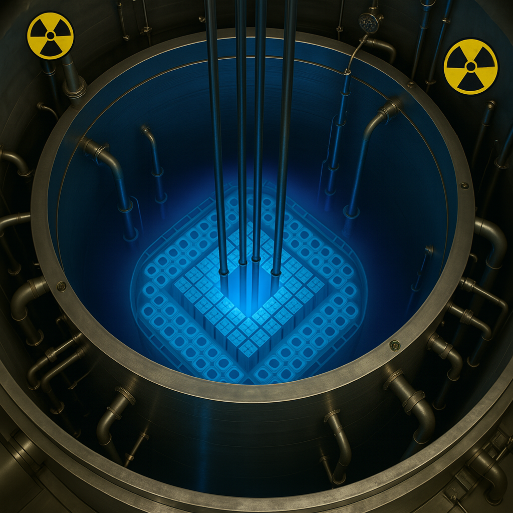

# Nuclear-Reactor-Core-Optimization-Quantum-Computing
This project models core loading constraints as a QUBO problem and solves it using quantum computing methods to minimize local power peaks and ensure safety-compliant configurations. The pipeline, problem description, and results are included in the report (in-core.docx).

  

